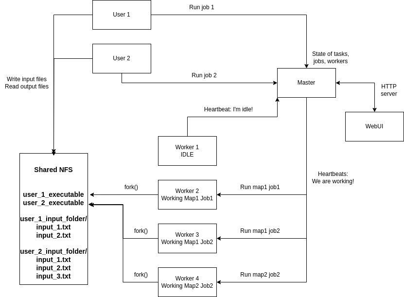

# Intermediate deliverables

- Product vision: [Product vision](assets/product_vision.md)
- Product features and product roadmap: [Product features](assets/product_features.md)
- Non functional requirements: [Non functional requirements](assets/non_functional_requirements.md)
- User Personas and customer journey Map: [Customer journey](assets/customer_journey.md)
- Activity diagram: [Activity diagram](assets/activity_diagram.md)
- User stories: [User stories](assets/user_stories.md)
- Product backlog: [Product backlog](https://trello.com/b/w71cxBJY/map-reduce)

# Final deliverables
- Software architecture backlog: [Software architecture report](assets/software_architecture_report.md)
- Sprint 1 report: [Sprint 1](assets/sprint1_report.md)
- Sprint 2 report: [Sprint 2](assets/sprint2_report.md)
- Sprint 3 report: [Sprint 3](assets/sprint3_report.md)
- Sprint 4 report: [Sprint 4](assets/sprint4_report.md)
- Sprint 4 review recording: [Youtube](https://youtu.be/BunA39FKX0U)
- Paradigme de testare: [Testare](assets/testing_paradigms.md)
- Burndown chart: [Burndown chart](assets/sprint4_report.md)

# Koala - Intro

This project aims to implement a distributed Map/Reduce programming model. Using this model, large amounts of data can be processed in parallel by multiple workers.
 
The original paper describing Google's implementation of this programming model can be found at https://static.googleusercontent.com/media/research.google.com/en//archive/mapreduce-osdi04.pdf.

# Paper recap

A typical Map/Reduce workflow is as follows:
1. User supplies *input files* containing key-value pairs (k1, v1) and two functions:
    - map : (k1, v1) -> list (k2, v2)
    - reduce : (k2, list(v2)) -> list(v2)
2. The MapReduce library in the user program splits the input files into M pieces (typically of 16MB to 64MB)
3. M (possibly different) workers pick up the M input splits
4. A map-worker reads the different (k1, v1) pairs from its input split, runs them through the map function
5. The intermediate list of (k2, v2) pairs is stored in R *intermediary output files*, an arbitrary pair (k2, v2) being stored in the (hash(k2) % R)-th file
    - each map worker has (up to) R intermediary output files, so there are in total (up to) M*R intermediary output files globally
6. R (possibly different) workers pick up the R reduce tasks
7. A reduce-worker reads the (up to) M different intermediary output files corresponding to its reduce partition
8. After all the intermediary data is read, a reduce-worker sorts the (k2, v2) pairs - this way, all entries with the same key end up being consecutive
9. A reduce-worker runs the reduce function on the (k2, (list v2)) pairs, writing the result of this function to an *output file*
    - each reduce worker has (up to) an output file, so there are in total (up to) R output files
10. After all R reduce tasks are completed, the user program is notified and it can continue execution

#### Library interface
- We may simplify the interface of the Map/Reduce library as follows:
    - inputs:
        - input files with (k1, v1) pairs
        - map and reduce functions
        - M: parameter for the number of input splits. This also matches the number of map tasks
        - R: parameter for the number of output files. This also matches the number of reduce tasks
    - output:
        - (up to) R output files

#### Library guarantees
- Guarantees that the library provides:
    - the Map/Reduce workflow returns either an error, or (up to) R output files
    - the output of the workflow would have been the same as if everything had run sequentially    
    - the workflow will be fault-tolerant: map or reduce tasks that fail will be retried until they succeed (or a certain retry-limit threshold is reached)
    - input files will not be altered

# Proposed architecture

#### Entities
- We separate the entities involved in the Map/Reduce workflow in three categories:
    - User node:
        - This is the machine that runs the user code
        - The user code should be agnostic to the intricacies of the system:
            - Hide the interactions behind a library with a minimal interface
            - The library should expose an interface that takes as parameters the "inputs", and returns the "outputs"
    - Master node:
        - This is the node that coordinates the scheduling of all map and reduce tasks and monitors the worker pool
    - Worker pool:
        - These are nodes that can run different map and reduce tasks

#### Communication
- To make these different entities communicate, we may employ a number of strategies. One (very simple) proposal could be as follows:
    - All nodes share a NFS - this way, the user code and worker pool nodes can manipulate input/output files. User code binaries are also stored here, so that the worker pool nodes can fork() and execve() them, thus gaining access to user-provided map and reduce functions
    - The user node (hidden behind the Map/Reduce library), the master node and the worker pool nodes host RPC (or gRPC) servers:
        - The user node's RPC (or gRPC) server has one endpoint:
            - finish(job_id, list(output_files)): called by the master node after all map/reduce tasks corresponding to the job job_id are finished
        - The master node's RPC (or gRPC) server has two endpoints:
            - register_map_reduce_job(job_id, list(input_files), map_function_name, reduce_function_name, M, R): called by the user code to register a new Map/Reduce workflow
            - heartbeat(worker_pool_node_id, status): liveness probe for worker pool nodes (also used to communicate when workers come online, when they finish tasks etc.)
        - The worker pool nodes' RPC (or gRPC) server has one endpoint:
            - assign_task(task_type, list(input_files), map or reduce function): called by master to assign a map or a reduce task to this worker

#### Internal state
- All these nodes need to keep some internal state in order to orchestrate these actions (the following is an unexhaustive list):
    - master node:
        - queue of tasks (and their statuses - idle, in progress, finished)
        - IPs, ports and statuses (waiting, running, offline) of the worker nodes
        - lists of intermediary output files generated by map tasks of Map/Reduce jobs
        - etc.
    - worker node:
        - status (waiting, running); if status is running, the worker node should know the task it is running (e.g: the r-th reduce task for Map/Reduce job j1)

### Diagram
To make this project more "visual", the master node may expose a HTTP server, so that a WebUI may show the state of the Map/Reduce infrastructure.

The following diagram shows a possible scenario, with two users that have submitted Map/Reduce jobs:
 
 

# Proposed implementation

We might break up the implementation into several stages:
1. Establish communication between user node, master node and worker nodes:
    - make worker nodes execute simple functions such as printing to stdout
    - do not worry about heartbeats, retries, input and output files
2. Implement a basic Map/Reduce workflow:
    - simple file formats for input and output files (keys and values are strings, separated by commas or newlines, etc.)
    - implement master data structures to keep track of tasks and jobs
    - step 8 in the Map/Reduce workflow can be done naively - i.e. read all contents into RAM, then sort
    - simple WebUi for monitoring the state of the Map/Reduce architecture
    - do not worry about heartbeats and retries
3. Make Map/Reduce workflow fault-tolerant:
    - introduce heartbeats, retries
4. Nice-to-have functionality:
    - nice WebUi for monitoring the state of the Map/Reduce architecture
    - custom formats for input and output files:
        - user provides parsing code
    - step 8 in the Map/Reduce workflow can be done using external sort
    - stretch goal:
        - for each reduce job, we can separately sort all M intermediary files as they are produced by map workers
        - run M-way merge to read (k2, list(v2)) pairs in order
5. Translate problems into the Map/Reduce programming model to show potential use cases

# How to set up and run?
- This only works under linux, we recommend ubuntu but any debian based distro should work
- Check [Setup](assets/setup.md)
