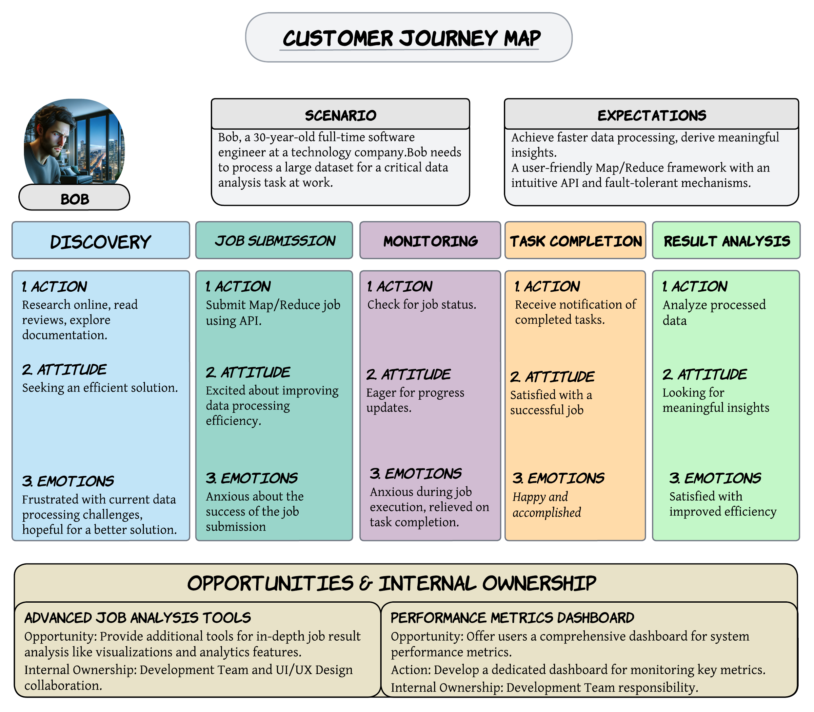

# <u>User personas</u>

## Name: Bob

### <u>Demographic Information:</u>

 - Age: 30

 - Gender: Male

 - Family/Living Situation: Single, living in an urban apartment

 - Employment Status: Full-time software engineer at a technology company

### <u>Needs and Goals:</u>
- Bob needs an efficient and reliable Map/Reduce framework to process large datasets for his data analysis tasks at work.
- He wants the system to have a simple and intuitive API for submitting Map/Reduce jobs.
- Bob's goal is to improve data processing speed and scalability, reducing the time it takes to derive meaningful insights from data.

### <u>Challenges, Frustrations, and Pain Points: </u>
- Bob is frustrated with complex and error-prone data processing pipelines.
- He struggles with managing distributed systems and dealing with the intricacies of parallel processing.
- Any downtime or system failures would delay his analysis and be a significant pain point.

## Name: Alice

### <u>Demographic Information:</u>

 - Age: 28
 - Gender: Female
 - Family/Living Situation: Married with one child, living in a suburban home
 - Employment Status: Part-time data scientist, working from home
### <u>Needs and Goals:</u>
- Alice needs a user-friendly Map/Reduce framework to process and analyze data without having to delve into the complexities of distributed systems.
- She wants the system to support custom data formats, as her work often involves non-standard data sources.
- Alice's goal is to balance work and family life, so she values tools that are easy to use and time-efficient.
### <u>Challenges, Frustrations, and Pain Points:</u>
- Alice is challenged by the technical aspects of distributed computing, which can be a barrier to her productivity.
- Her frustration lies in the time and effort required to set up and manage data processing tasks.
- Any system outages or lack of user-friendly features would be a significant pain point for her.

 
 
 

# <u>User Jorney Map</u>

