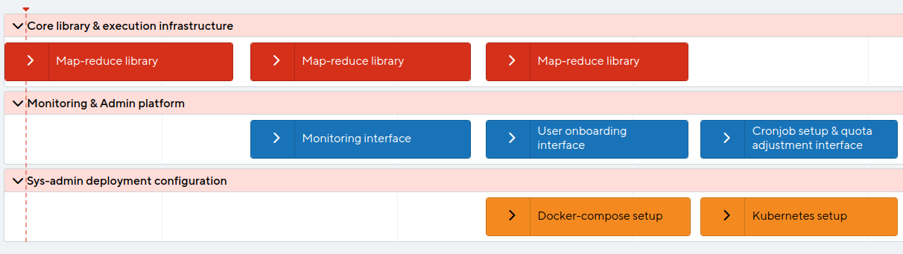

# Product features and functionalities

Here, we have compiled the list of features and functionalities that deliver value to the stakeholders. Firstly, we will list them and give a brief description to align them with our product vision, and then we will lay out a product roadmap to show the important stages in the development and release process.

## List of features and functionalities

| **Feature**                 | **Description**                                                                                                                                                                                                                                                                              |
|-----------------------------|----------------------------------------------------------------------------------------------------------------------------------------------------------------------------------------------------------------------------------------------------------------------------------------------|
| Effortless Kubernetes Setup | A sys-admin should bring the whole infrastructure up with only one command. As Kubernetes is an omnipresent choice for container orchestration, we will cater to this platform.                                                                                                              |
| Map-Reduce Library          | This product will provide the clients with a library with map-reduce semantics. As a lot of real-world problems can be reduced to the map-reduce programming model, we will cater to these semantics. This enable direct and concise expression of ideas in terms of functional computation. |
| Parallel Task Execution     | The core feature of the product is the ability to leverage the functional map-reduce semantics in order to parallelize large computations. This leads to decreased execution time and empowers users to process data sets that would not fit in the memory of commodity hardware.            |
| Resource Monitoring         | The product exposes a web-based resource monitor that can be used by admins to monitor resource usage and estimate costs. The use of resources can be examined over a longer period of time as well as in minute detail.                                                                     |
| User onboarding             | Admins can onboard new users to the infrastructure and allow them to utilize the cluster of machines for their own computations.                                                                                                                                                             |
| Cronjob setup               | Periodic (parallel) jobs can be set up to run on this infrastructure. This way, expensive periodic parallel computations get a simple, UNIX cron-like interface.                                                                                                                             |
| Quota adjustments           | Admins can set up limits for resource utilization, on a per-user basis. These quota limits can be adjusted to accommodate higher loads.   

## Product roadmap

