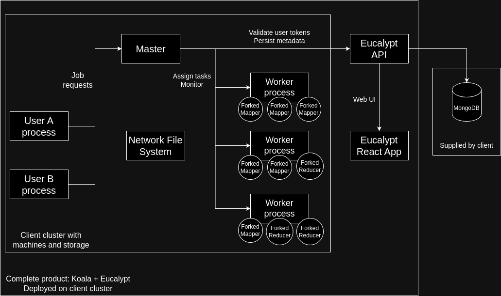

# Software architecture report

This report is up-to-date as of commit ```3bd2d276f0a15b56c4a3ced5d5a65d19c4cdcf7e```.

### Project summary (fulfilled capabilities, future capabilities)
Available capabilities:
<ul>
<li>ability to run a distributed computation across a cluster of workers in a fault tolerant way:
    <ul>
    <li>tasks from the computation are spread uniformly across the cluster (greedily choosing machines with lowest load)</li>
    <li>workers that die (or become partitioned from the cluster) have their assigned tasks reassigned to healthy workers</li>
    </ul>
</li>
<li>ability to monitor ongoing and past jobs in a web UI</li>
<li>ability to create/delete/manage users and set quotas (CPU time) for them</li>
</ul>

Future capabilities:
<ul>
<li>ability to run a computation on a single machine (multiprocess)</li>
<li>ability to set periodic jobs</li>
</ul>

### How to build, run and deploy the project
Build: Read [Initial setup](setup.md#Initial-setup).
<br>
Running: Read [Running locally](setup.md#Running-locally), [Running in docker](setup.md#Running-in-docker) and [Running in docker-compose](setup.md#Running-in-docker-compose).
<br>
Deploy: Read [Deployment](setup.md#Deployment).

### Application entrypoints
Data sources (storage): a NFS for the computing cluster and a MongoDB database for the Web UI.
<br>
Data inputs (how users interact with our product): 
<ul>
<li>users can link their binaries against the shared library <code>Koala</code></li>
<li>users can monitor and manage their workloads via <code>Eucalypt</code> via a Web UI</li>
</ul>

### Architecture


### CI/CD pipeline
CI:
<ul>
<li>Tests from the <code>test</code> directory are run as part of the GitHub actions workflow</li>
<li>TODO: end-to-end tests</li>
</ul>

CD:
<ul>
<li>Currently deployed on Digital Ocean</li>
<li>Managed by <a href="https://helm.sh"/>Helm</a></li>
</ul>


### External dependencies
For ```koala```, the dependencies are the C++ ```grpc``` and ```boost``` libraries.

For ```eucalypt```, we have several dependencies:
<ul>
<li>Backend/API: it is a Node app, it depends on <code>Express</code>, <code>Mongoose</code> (for DB connection), <code>passport</code> (for authentication)</li>
<li>Frontend: it is a React app, it depends on the <code>React</code> framework</li>
</ul>
