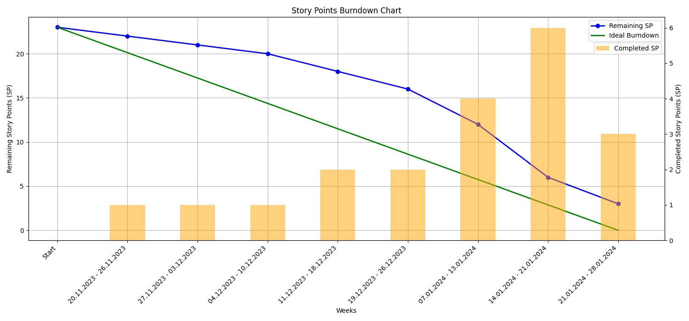

# Sprint 4 - Report

- Contains the dates of the sprint (when it started, when it ended)
    - 10.01.2024 - 28.01.2024
    - Last commit hash: [da13ffa1d1fbcd3a7215c2b196b259a80c5b7c9e](https://github.com/inginerie-software-2023-2024/proiect-inginerie-software-shark-rockets/commit/da13ffa1d1fbcd3a7215c2b196b259a80c5b7c9e)
    - Recording of the sprint review: [YouTube](https://youtu.be/BunA39FKX0U)
- Overview of the team and their planned capacity
    - Full team available
- List of backlog items planned to be developed in the current Sprint
    - Addressed user stories (global list of user stories, along with acceptance criteria: [User stories](user_stories.md))
        - As a network administrator, I want to be able to set up this infrastructure on my Kubernetes cluster, so that my organization can benefit from the parallelization features provided
        - As a network administrator, I want to be able to scale the cluster by adding or removing machines dynamically so that the cluster perfectly fits the users’ needs
        - As a user, I want to set up recurring or scheduled map-reduce jobs so that they can execute without manual triggering
    
    - Indicate items that were added after the Sprint start
        - [Redesign token generation page](https://github.com/inginerie-software-2023-2024/proiect-inginerie-software-shark-rockets/commit/f63cb0e1bc38958e3057359b837919284d7ecbbd)
        - [End-to-end Koala testing](https://github.com/inginerie-software-2023-2024/proiect-inginerie-software-shark-rockets/commit/da13ffa1d1fbcd3a7215c2b196b259a80c5b7c9e)

    - Indicate items that were removed before the Sprint end
        - As a guest, I want to create a map-reduce job and run it *concurrently on the local machine*, without creating an account, so that I can try this product's functionalities

- Status of planned items and their status
    - Marking the done items:
        - As a network administrator, I want to be able to set up this infrastructure on my Kubernetes cluster, so that my organization can benefit from the parallelization features provided
        - As a network administrator, I want to be able to scale the cluster by adding or removing machines dynamically so that the cluster perfectly fits the users’ needs
        - As a user, I want to set up recurring or scheduled map-reduce jobs so that they can execute without manual triggering.
    - Marking the unsolved items, and what are you going to do with them (push to future sprint, eliminate from project, etc.):
        - As a guest, I want to create a map-reduce job and run it *concurrently on the local machine*, without creating an account, so that I can try this product's functionalities -> abandoned

- Sprint Review (This can be an audio recording of your team's discussion)
    - During a challenging period marked by high contention among team members due to other projects and exam study time, our final sprint stands out as a success. We not only successfully incorporated the last remaining valuable functionality, enabling the scheduling of periodic jobs, but also deployed our infrastructure on Digital Ocean using Helm charts. Helm charts require little deployment effort, not only for us, but also for any potential client.
    - A noteworthy accomplishment of this sprint is the end-to-end testing of the Koala infrastructure, serving as a valuable complement to the existing unit testing for the library. Given the interconnected nature of our project's various communicating processes, treating the system as a whole through end-to-end testing became particularly relevant.
    - The only setback could be perceived as the inability to implement the last user story, which focused on allowing guests to create and run map-reduce jobs concurrently on the local machine without creating an account. However, this feature, while not crucial to the product's core ethos of parallel programming, can be easily integrated at a later date, as our current library-master-worker infrastructure readily supports it.
    - Concluding this ambitious project, which involved the utilization of C++, JavaScript with Node.js & React, Python, bash scripting, and various CI tools, we take pride in the achieved work. We successfully completed 12 out of 13 user stories, improved several initially proposed implementations, and subjected the application to rigorous unit testing, end-to-end testing, and manual testing. Team coordination remained exemplary, allowing us to navigate each sprint with flexibility, adjusting priorities within the current sprint while seamlessly pushing others to subsequent sprints. This was achieved while implementing all core functionalities of the product and incorporating the majority of the nice touches.
    - Recording of the discussion: [YouTube](https://youtu.be/BunA39FKX0U)

- Since this is the last sprint of the project, we can observe our work distribution across the weeks in the following burndown chart:

